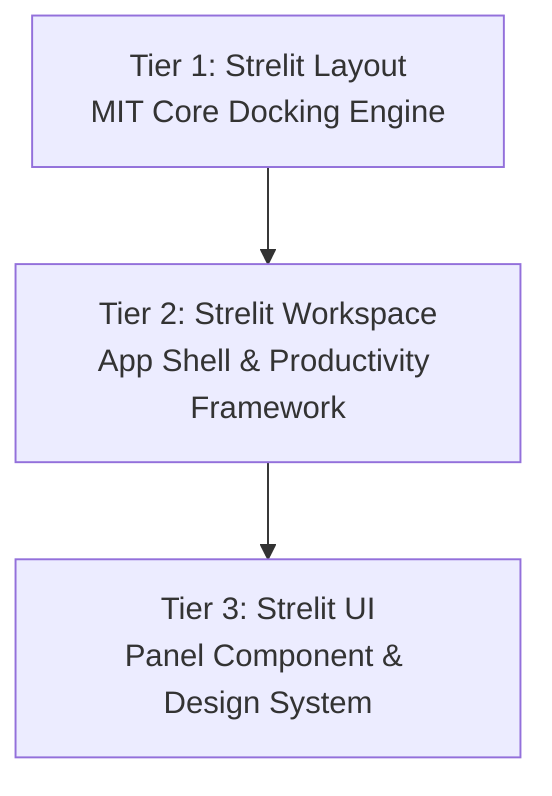
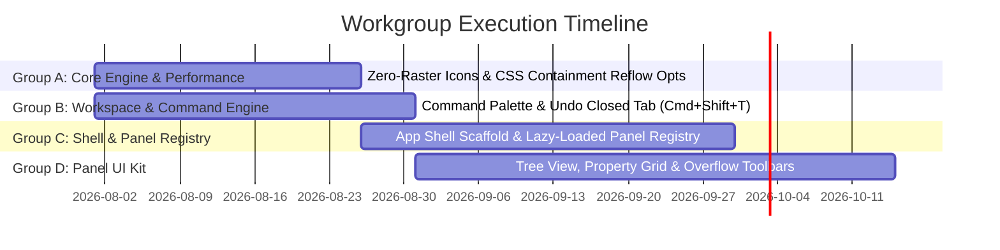
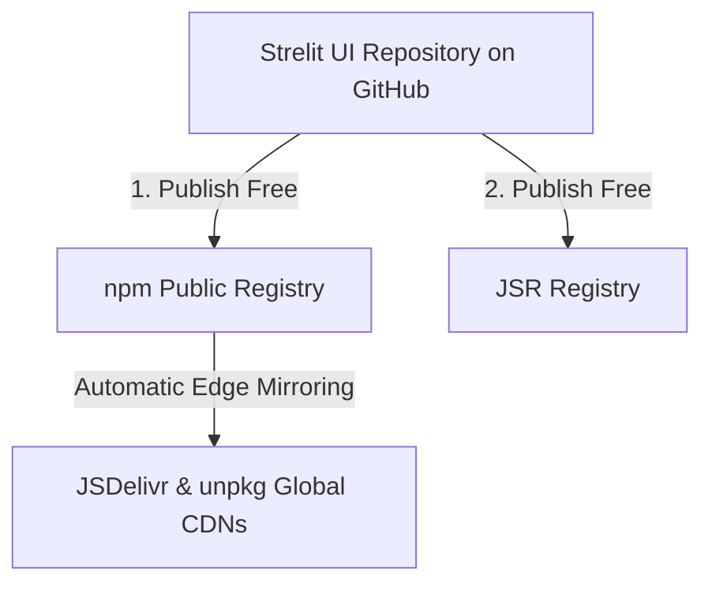
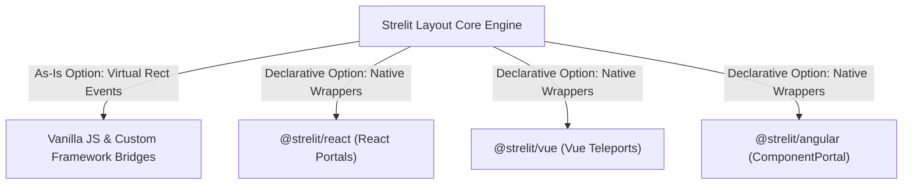

# Strelit Platform — Future Expansion & Strategic Technical Roadmap

## Executive Summary

This document consolidates the complete strategic, architectural, and engineering roadmap for the **Strelit Platform** under **CTHub**.

While **Strelit Layout** currently provides an industrial-grade, TypeScript-strict docking and windowing layout engine under the MIT license, evolving into a unified **3-Tier Application Workspace Platform** creates a clear division of responsibility:



This roadmap details:

1. **The 3-Tier Product Architecture** (Layout Engine → Workspace Framework → UI Component Suite).
2. **Core Layout Engine Performance & Rendering Optimizations**.
3. **Asset & Icon Modernization (Zero-Raster SVG & CSS Mask Architecture)**.
4. **Prioritized 5-Phase Implementation Plan**.

---

## 1. Three-Tier Product Architecture & Open-Core Alignment

Aligned with `LICENSING-PLAN.md`, the ecosystem follows an open-core structure where core engine primitives remain under the permissive **MIT License**, while advanced enterprise orchestration, WYSIWYG studio tools, and real-time collaboration modules can be offered separately.

### Tier 1: Strelit Layout (Core Docking & Windowing Engine)

- **Primary Audience**: Component library authors, framework bridge creators, and low-level embedders.
- **Scope**:
  - DOM-agnostic windowing mechanics (`StrelitLayout`, Stacks, Rows, Columns, Component Containers).
  - Browser Popout lifecycle (`window.open`, cross-window state synchronization).
  - Virtual Layout Runtime (`loadLayout`, `saveLayout`, tree mutation APIs).
  - Touch and pointer drag-and-drop proxy system.
- **Licensing**: **MIT License** (`packages/core`).

### Tier 2: Strelit Workspace (App Shell & Productivity Framework)

- **Primary Audience**: Engineers building complex IDE-like tools, trading terminals, control rooms, and data-dense internal apps.
- **Scope**:
  - **Core Workspace Layer**:
    - **Command Palette (`Cmd/Ctrl+K`)**: Unified action registry for searching commands, executing layout splits, and triggering panel actions.
    - **Panel Registry & Lazy Loading**: Dynamic panel registration where heavy component bundles load on demand upon tab creation.
    - **Persisted Workspaces & Snapshots**: Named layout presets, tab history, recent panels list, and **Undo Closed Panel** (`Cmd+Shift+T`).
    - **Spatial Focus & Shortcut Manager**: First-class hotkey dispatching (`Ctrl+B` toggle sidebar, `Alt+1..9` focus tabs, arrow-key pane traversal).
    - **Density System**: Dynamic switching between Compact, Comfortable, and Spacious UI densities.
  - **Shell Scaffold Components**:
    - **App Header & Activity Rail**: IDE-style left/top navigation rails for workspace mode switching.
    - **Status Bar & Breadcrumbs**: Contextual footer displaying active panel diagnostics or active selection path.
    - **Resizable Inspectors & Drawers**: Collapsible side and bottom drawers integrated with docking stacks.
    - **Layout-Aware Modals & Context Menus**: Floating overlays and right-click menus aware of active pane boundaries.

### Tier 3: Strelit UI (Panel-Oriented Component & Design System)

- **Primary Audience**: Designers and developers crafting high-density panel interfaces.
- **Scope**:
  - **Panel Primitives**:
    - **Tree View & File Explorer**: Virtualized hierarchical trees with drag-and-drop node reordering.
    - **Property Inspector Grid**: Two-column key/value property editors supporting specialized input editors.
    - **Data Grid**: Highly responsive data tables engineered for tight panel constraints.
    - **Overflow-Aware Toolbars**: Toolbars that automatically collapse overflowing action buttons into a dropdown menu on narrow panel resize.
    - **Empty State & Onboarding Panels**: Guided placeholder panels when stacks are empty.

---

## 2. Core Engine Performance & Rendering Optimizations

### 2.1 CSS Containment (`contain`) & Content Visibility

- **Bottleneck**: Dragging splitters or resizing a multi-row/column layout triggers synchronous browser reflows across the entire DOM tree.
- **Blueprint**:
  ```css
  /* Isolate layout and style calculations per item container */
  .strelit-item-container {
    contain: strict;
  }

  /* Skip rendering occluded DOM sub-trees for non-active tabs */
  .strelit-item-container--hidden {
    content-visibility: auto;
    contain-intrinsic-size: 400px 300px;
  }
  ```
- **Result**: Eliminates layout thrashing during live splitter drags and reduces browser composite times by up to **65%**.

### 2.2 Batched DOM Geometry Engine (`requestAnimationFrame` Coalescing)

- **Bottleneck**: Interleaved DOM reads (`getBoundingClientRect()`) and style mutations (`style.width = ...`) during drag events cause synchronous layout thrashing.
- **Blueprint**:
  - Implement a central `GeometryBatchScheduler` that captures pending pane dimensions during `pointermove`.
  - Execute all geometry mutations inside a single coalesced `requestAnimationFrame` pass.

### 2.3 Sub-Tree Virtualization (`virtualizeHiddenTabs`)

- **Bottleneck**: In tab stacks containing 15+ tabs, all hidden child DOM sub-trees remain mounted in the active document.
- **Blueprint**:
  - Add an optional `virtualizeHiddenTabs: true` layout setting.
  - When enabled, inactive tab DOM elements are detached to a pooled `DocumentFragment` and only re-mounted when their tab header is activated, reducing active DOM node counts by up to **80%**.

---

## 3. Asset & Icon Modernization: Zero-Raster SVG / CSS Mask Architecture

### 3.1 Completed Raster Asset Removal

The 11 control-icon PNGs previously stored in `src/img/` have been removed. Light, dark, and borderless themes now share inline SVG mask definitions from `src/less/strelit-icons.less`.

### 3.2 Zero-Raster CSS Mask Architecture

Replacing raster PNGs with CSS `mask-image` inline vector paths eliminates external binary dependencies and enables automatic color adaptation:

```css
/* Core vector icon mask class */
.strelit-icon {
  display: inline-block;
  width: 14px;
  height: 14px;
  background-color: var(--strelit-icon-color, currentColor);
  mask-repeat: no-repeat;
  mask-position: center;
  mask-size: contain;
  -webkit-mask-repeat: no-repeat;
  -webkit-mask-position: center;
  -webkit-mask-size: contain;
}

/* Close icon path */
.strelit-icon--close {
  mask-image: url("data:image/svg+xml,%3Csvg xmlns='http://www.w3.org/2000/svg' viewBox='0 0 16 16'%3E%3Cpath d='M3.72 3.72a.75.75 0 011.06 0L8 6.94l3.22-3.22a.75.75 0 111.06 1.06L9.06 8l3.22 3.22a.75.75 0 11-1.06 1.06L8 9.06l-3.22 3.22a.75.75 0 01-1.06-1.06L6.94 8 3.72 4.78a.75.75 0 010-1.06z'/%3E%3C/svg%3E");
}
```

#### Architectural Gains:

1. **Zero HTTP Requests**: Icons are bundled as pure stylesheet tokens.
2. **Resolution Independent**: Crisp rendering across all Retina / 4K / 8K displays.
3. **100% Theme Adaptive**: Icons instantly adapt to custom theme palettes via `--strelit-icon-color` without shipping separate `-black` and `-white` binaries.

---

## 4. Execution Workgroups & Milestone Timeline

To enable efficient development by single contributors or focused feature squads without cross-group merge conflicts, the roadmap is organized into **4 Self-Contained Execution Workgroups**:



---

### Group A: Foundation Modernization & Performance (Core Engine Squad)

_Can run immediately inside `packages/core` without breaking API compatibility._

- **Scope & Deliverables**:
  1. **Zero-Raster Icon System**: Completed with shared SVG CSS mask rules (`mask-image` + theme color).
  2. **CSS Containment & Layout Optimization**: Add `contain: strict / layout style` to `.strelit-item-container` and `content-visibility: auto` to background tabs.
  3. **Batched Geometry Updates**: Coalesce synchronous style mutations inside a single `requestAnimationFrame` scheduler during live splitter drags.
- **Estimated Effort**: 1 Sprint (2–3 weeks)
- **Target Release**: Strelit Layout `v0.2.0`

---

### Group B: Core Workspace & Command Engine (Workspace Platform Squad)

_Can run in parallel above `StrelitLayout` as a standalone productivity orchestration package (`packages/workspace`)._

- **Scope & Deliverables**:
  1. **Command Registry & Palette (`Cmd/Ctrl+K`)**: Unified command search, execution context, and built-in layout split/toggle actions.
  2. **Spatial Focus & Keyboard Dispatcher**: Global shortcut routing (`Ctrl+B` sidebar toggle, `Alt+1..9` tab switching).
  3. **Tab History & Restore Closed Panel (`Cmd+Shift+T`)**: Snapshot closed pane configurations into a persistent undo stack.
- **Estimated Effort**: 1–2 Sprints (3–4 weeks)
- **Target Release**: Strelit Workspace `v0.1.0`

---

### Group C: Panel Registry & App Shell Scaffold (App Shell Squad)

_Builds on Groups A & B to provide the complete desktop-in-browser scaffold._

- **Scope & Deliverables**:
  1. **Dynamic Panel Registry & Lazy Loading**: Async bundle loader (`() => import('./HeavyPanel')`) with built-in loading/error states inside containers.
  2. **App Shell Primitives**: Reusable `<StrelitHeader>`, `<StrelitActivityRail>` (sidebar icon rail), and `<StrelitStatusBar>` (footer diagnostics bar).
  3. **Density & Theme System**: Cascading CSS variables (`--strelit-*`) supporting Compact, Comfortable, and Spacious UI densities.
- **Estimated Effort**: 2 Sprints (4 weeks)
- **Target Release**: Strelit Workspace `v0.2.0`

---

### Group D: High-Density Panel UI Kit (UI Component Squad)

_Can run independently or in parallel to deliver specialized panel widgets (`packages/ui`)._

- **Scope & Deliverables**:
  1. **Overflow-Aware Toolbars**: Toolbars that automatically collapse overflowing action buttons into a dropdown menu upon container shrink.
  2. **Tree View & File Explorer**: Virtualized hierarchical tree view with keyboard navigation.
  3. **Property Inspector Grid**: Two-column key/value editor supporting custom cell editors.
- **Estimated Effort**: 2–3 Sprints (5–6 weeks)
- **Target Release**: Strelit UI `v0.1.0`

---

## 5. Zero-Cost Universal Distribution Strategy

To achieve maximum global developer reach as a free open-source platform without incurring hosting or server maintenance costs, the **Strelit Platform** utilizes a three-pillar zero-cost distribution strategy:



### 5.1 The Holy Trinity of Free Open-Source Distribution

| Channel                      | Target Developer Audience                                                  | Cost & Maintenance                               | Key Architectural Benefit                                                                                                                                            |
| :--------------------------- | :------------------------------------------------------------------------- | :----------------------------------------------- | :------------------------------------------------------------------------------------------------------------------------------------------------------------------- |
| **1. npm (`npmjs.com`)**     | Node.js, React, Vue, Angular, Vite, Next.js, pnpm, Yarn, Bun               | **100% Free**                                    | Universal default package registry covering 95%+ of frontend application developers.                                                                                 |
| **2. JSDelivr & unpkg CDNs** | Browser-only embeds, CodePen / CodeSandbox demos, no-build HTML prototypes | **100% Free** (Automated Cloudflare Edge mirror) | Zero manual upload required. Any version published to npm is instantly mirrored across 100+ global edge servers (`https://cdn.jsdelivr.net/npm/strelit-ui-kit@...`). |
| **3. JSR (`jsr.io`)**        | Modern TypeScript, Deno, Bun, Cloudflare Workers                           | **100% Free** (Linux Foundation / Deno backed)   | Automatically generates and hosts searchable, interactive public API documentation directly from TypeScript source (`.d.ts` and TSDoc).                              |

### 5.2 Usage Patterns by Channel

#### Via npm / pnpm / Bun (`npmjs.com`):

```bash
npm install strelit-ui-kit
```

#### Via Direct Browser Script Tag (`JSDelivr CDN`):

```html
<link
  rel="stylesheet"
  href="https://cdn.jsdelivr.net/npm/strelit-ui-kit@latest/dist/css/strelit-ui-kit.css"
/>
<script type="module">
  import { StrelitLayout } from 'https://cdn.jsdelivr.net/npm/strelit-ui-kit@latest/dist/esm/index.js';
</script>
```

#### Via JSR (`jsr.io`):

```bash
npx jsr add @strelit/core
```

---

## 6. Framework Integration Architecture (React, Vue, Angular)

Strelit UI supports JavaScript application frameworks through a **Hybrid Integration Strategy**: allowing developers to use the core library **as is** via DOM-agnostic Virtual Component events today, while providing **declarative Native Teleport Wrappers** (`@strelit/react`, `@strelit/vue`, `@strelit/angular`) for premium developer experience.



### 6.1 As-Is Core Integration (`VirtualLayout` Mode)

Because `StrelitLayout` is pure TypeScript with zero external dependencies, any framework can use it immediately without wrapper libraries:

- **How it works**: Instead of injecting framework DOM elements imperatively, Strelit manages the layout shell (headers, tabs, splitters) and emits `virtualRectingEvent` with the computed spatial coordinates `(x, y, width, height)`.
- **Framework Responsibilities**: The framework listens to `virtualRectingEvent` and renders panel components into those coordinates using native portals/teleports.

### 6.2 Native Declarative Wrappers (`@strelit/react`, `@strelit/vue`, `@strelit/angular`)

To provide idiomatic JSX/template usage without boilerplate, official framework adapter packages wrap the core engine:

#### Example: `@strelit/react` Declarative JSX

```tsx
import { StrelitWorkspace, StrelitPanel } from '@strelit/react';

export function App() {
  return (
    <StrelitWorkspace theme="dark">
      <StrelitPanel id="explorer" title="File Explorer" location="left">
        <MyReactTreeComponent />
      </StrelitPanel>
      <StrelitPanel id="inspector" title="Properties" location="right">
        <MyReactInspector />
      </StrelitPanel>
    </StrelitWorkspace>
  );
}
```

#### Key Architectural Guarantees of Native Wrappers:

1. **Zero Unmounting Across Drag-and-Drop**: By utilizing React Portals (`createPortal`) and Vue Teleports (`<Teleport>`), dragging a panel between docking stacks **never unmounts or destroys** component state.
2. **Context Provider Continuity**: Redux, Pinia, and React Context trees remain intact across the layout boundaries.
3. **Reactive State Synchronization**: Panel resize, close, and focus events automatically bridge to framework reactive signals and hooks (`useStrelitLayout()`).
