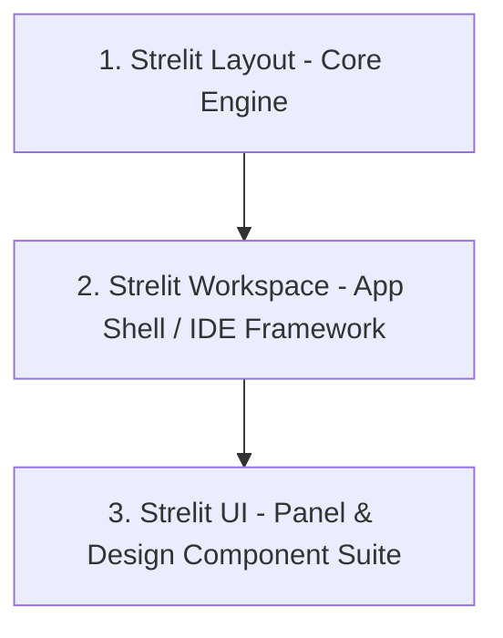

# Strelit UI — Strategic Expansion & Performance Optimization Roadmap

## Executive Summary

This document defines the strategic and technical expansion plan for **Strelit UI** under the **CTHub** brand. While the foundational MIT core provides an industrial-grade windowing and docking layout engine, expanding beyond a single layout library into a modern **Application Workspace Platform** unlocks both superior end-user ergonomics and clear commercial open-core opportunities.

---

## 1. Three-Tier Product Identity & Ecosystem Architecture

To establish a commanding product identity under **CTHub**, the platform is structured into three clear, complementary tiers:



### 1.1 The Three Pillars

1. **Strelit Layout (Core Engine)**
   - **Role**: High-performance, DOM-agnostic windowing and docking layout engine (`StrelitLayout`, stacks, splitters, popouts, drag-and-drop tree operations).
   - **Target Audience**: Embedders and framework developers needing raw, reliable docking mechanics.
   - **Licensing**: **MIT License** (Open Source Foundation).

2. **Strelit Workspace (Productivity & App-Shell Layer)**
   - **Role**: Complete application shell framework for complex internal tools, control rooms, and IDE-like applications.
   - **Core Capabilities**:
     - **Command Palette (`Cmd/Ctrl+K`)**: Global command registration, layout splitting, and action dispatch.
     - **Panel Registry & Lazy Loading**: On-demand panel mounting when tabs are opened or restored.
     - **Persisted Workspaces & Snapshots**: Presets, tab history, recent panels, and undo closed panel (`Cmd+Shift+T`).
     - **Keyboard & Focus System**: First-class shortcut routing and spatial focus manager.
     - **Shell Scaffold**: App Header, Activity Rail / Sidebar, Status Bar, Breadcrumbs, and Resizable Inspectors.

3. **Strelit UI (Panel-Oriented Component & Design System)**
   - **Role**: Specialized UI component library engineered for high-density, panel-based workflows.
   - **Core Capabilities**:
     - **Panel Primitives**: Tree View, Property Inspector / Grid, Data Grid, Toolbars with overflow handling, Empty/Onboarding panels.
     - **Design Token & Density System**: Cascading CSS variables for colors, spacing, z-index, and compact/comfortable/spacious density modes.
     - **Zero-Raster Vector Icons**: Resolution-independent SVG/CSS mask icons.

---

### 1.2 Prioritized Execution Roadmap

To build out the workspace platform incrementally while maintaining rock-solid stability, engineering priorities are sequenced as follows:

1. **Command System (`Cmd/Ctrl+K`)**: Unified command registry and keyboard shortcut dispatcher.
2. **Panel Registry & Plugin Model**: Decoupled panel definitions supporting lazy-loaded component bundles.
3. **App Shell Components**: Reusable Header, Activity Rail, and Status Bar primitives.
4. **Theme & Token System**: Zero-compile CSS custom properties (`--strelit-*`) with light, dark, and high-contrast themes.
5. **Panel Primitives**: Tree View, Property Inspector Grid, and Overflow-Aware Toolbar components.

---

## 2. Main Layout Engine Performance & Customizability Optimizations

### 2.1 Performance Bottlenecks & Optimization Blueprints

1. **CSS Containment (`contain: strict / layout style`) & Content Visibility**
   - **Problem**: Dragging splitters or resizing a 10×10 grid triggers browser-wide synchronous layout reflows across hundreds of nested DOM elements.
   - **Solution**: Apply `contain: strict` or `contain: layout style` to every item container (`.strelit-item-container`). Use CSS `content-visibility: auto` for occluded background tabs so off-screen panels skip rendering pipelines entirely.

2. **DOM Read/Write Batching (`requestAnimationFrame` / ResizeObserver coalescing)**
   - **Problem**: During rapid mouse dragging or window resizing, synchronous geometry reads (`getBoundingClientRect()`, `offsetWidth`) interleaved with DOM style mutations cause layout thrashing.
   - **Solution**: Implement a dedicated geometry scheduler that queues DOM mutations and executes them in batched `requestAnimationFrame` cycles.

3. **Sub-Tree Virtualization for Stacks & Heavy Tabs**
   - **Problem**: Stacks with dozens of tabs keep all hidden child DOM trees mounted and active.
   - **Solution**: Introduce a `virtualizeHiddenTabs: true` config mode that detaches inactive tab contents from the DOM tree (or parks them in a hidden document fragment), cutting memory and DOM node counts by up to 80%.

---

## 3. Asset & Icon Modernization: Eliminating Raster PNGs

### 3.1 Completed Raster PNG Removal

Strelit's control icons now use shared inline SVG masks. The previous 11 PNG files and package-copy step have been removed.

- **Bundle Bloat & HTTP Overhead**: Raster PNGs require separate HTTP requests or base64 data-URI duplication per theme.
- **DPI Scaling Issues**: PNGs look blurry on 4K/Retina displays unless multi-scale assets are shipped.
- **Color Inflexibility**: Requires separate `-black.png` and `-white.png` files for light/dark themes.

### 3.2 The Modernization Solution: CSS Mask Icons (`mask-image` + `currentColor`)

By converting icons to inline SVG path data rendered via CSS `mask-image`, one single CSS rule handles all resolutions and automatically inherits text/theme colors:

```css
/* Zero-raster icon pattern using CSS mask-image */
.strelit-icon {
  display: inline-block;
  width: 14px;
  height: 14px;
  background-color: var(--strelit-icon-color, currentColor);
  mask-repeat: no-repeat;
  mask-position: center;
  mask-size: contain;
}

.strelit-icon-close {
  mask-image: url("data:image/svg+xml,%3Csvg xmlns='http://www.w3.org/2000/svg' viewBox='0 0 16 16'%3E%3Cpath d='M3.72 3.72a.75.75 0 011.06 0L8 6.94l3.22-3.22a.75.75 0 111.06 1.06L9.06 8l3.22 3.22a.75.75 0 11-1.06 1.06L8 9.06l-3.22 3.22a.75.75 0 01-1.06-1.06L6.94 8 3.72 4.78a.75.75 0 010-1.06z'/%3E%3C/svg%3E");
}
```

#### Performance & Ergonomic Benefits:

- **Zero HTTP requests**: Embedded clean SVG data-URIs directly inside CSS design tokens.
- **100% Theme Adaptive**: Hover states (`--strelit-icon-color: var(--strelit-accent-color)`) transition smoothly without swapping background image URLs.
- **Package Size Reduction**: Eliminates all 11 binary `.png` files from `src/img/` and npm package bundles.

---

## 4. End-User Customizability: Modern CSS Variables & Design Tokens

To make Strelit UI effortlessly customizable without requiring users to compile LESS/SCSS, all visual properties will be exposed via a hierarchy of **CSS Design Tokens**:

```css
:root {
  /* Layout spacing & geometry */
  --strelit-splitter-width: 5px;
  --strelit-header-height: 28px;
  --strelit-tab-border-radius: 4px 4px 0 0;

  /* Theme color palette */
  --strelit-bg-primary: #1e1f22;
  --strelit-bg-secondary: #2b2d30;
  --strelit-border-color: #393b40;
  --strelit-text-color: #dfe1e5;
  --strelit-accent-color: #3574f0;
  --strelit-icon-color: var(--strelit-text-color);
}
```

Developers can dynamically restyle or brand their entire application workspace at runtime simply by setting CSS variables on the layout container (`container.style.setProperty('--strelit-accent-color', '#10b981')`).
